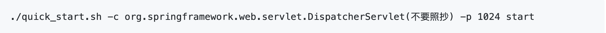

* [日志目录](#日志目录)
* [not find proxy for agent](#not-find-proxy-for-agent)
* [获取ip错误](#获取ip错误)
* [agent attach时加载初始化类失败](#agent-attach时加载初始化类失败)
* [windows 环境暂时不支持](#windows-环境)
* [在线debug暂时不支持github仓库的源码调试](#在线debug暂时不支持github仓库的源码调试)
* [jdk版本](#jdk版本)
    * [应用jdk版本要求](#应用jdk版本要求)
    * [bistoury自带模块最低的jdk版本要求](#bistoury自带模块最低的jdk版本要求)
* [端口问题](#端口问题)
    * [默认占用端口](#默认占用端口)
    * [修改默认端口](#修改默认端口)
* [在线debug时,前端界面上对象值显示 `object size greater than ***kb`](#在线debug时前端界面上对象值显示-object-size-greater-than-kb)
* [在线debug时 前端界面右上角提示 *** 代码查看仅可通过反编译](#在线debug时-前端界面右上角提示--代码查看仅可通过反编译)
* [在线debug添加断点出现 `register breakpoint fail, File was not found in the executable`](#在线debug添加断点出现-register-breakpoint-fail-file-was-not-found-in-the-executable)
* [动态监控添加监控出现 `add monitor failed, File was not found in the executable`](#动态监控添加监控出现-add-monitor-failed-file-was-not-found-in-the-executable)


### 日志目录

---

|      模块            | 输出的具体文件夹                         |
|:---------------------|:------------------------------|
| 1. agent          | 解压缩目录/bistoury-agent-bin/logs |
| 2. proxy         | 解压缩目录/bistoury-proxy-bin/logs |
| 3. ui             | 解压缩目录/bistoury-ui-bin/logs    |
| 4. attach到应用中的部分 | 应用进程所属用户的主目录/logs/   |

### not find proxy for agent

---

问题原因：出现这个错误的根本原因就是ui根据应用中心的ip从所有proxy上都没有查询到agent的注册信息

问题排查：
   - 检查proxy的日志，看下proxy是否启动成功
   - 访问proxyip:proxyPory/proxy.html（可能需要到每台proxy都去看一下） 到版本信息里面使用agent的ip去查询一下
      - 如果不存在，则说明agent没有连接到proxy，检查下agent的日志
      - 如果存在，则说明应用中心的ip和agent上报的ip不一样，可以修改应用中心的ip，也可以在agent启动的时候通过-i参数指定你需要的ip      
### 获取ip错误

---

在使用快速脚本时出现的情况较多，往往表现为在ui上调用命令时

- websocket连接失败

- no proxy for agent

原因如下：

- 本机可能存在多个ip，导致获取的ip不是当前正在使用的ip（获取到的ip可以在各个日志中查看，也可以在应用中心查看），从而出错
- 当使用外网的虚拟机时，本地使用服务器获取到的内网ip时无法连通的，需要在启动时将ip指定为外网ip

可以通过`quick_start.sh`脚本中的-i参数指定当前的ip。

例子 : 其中`1024`为你要诊断的应用的进程号
```
./quick_start.sh -i 127.0.0.1 -p 1024 start
```

# agent attach时加载初始化类失败

---

往往表现为在ui上调用命令时报"can not init bistoury, start arthas error"，"Agent JAR loaded but agent failed to initialize"，同时在agent的log中也会有一样的错误日志。

这时去“应用进程所属用户的主目录/logs/arthas/arthas.log”中查找日志，如果发现错误"can not find lib class"，那么可以确定是这个问题。

原因是agent在初始化时需要加载一个初始化类，也就是快速启动脚本-c所指定的类。这个类应当是应用已加载的依赖的jar包中的类，默认是spring的org.springframework.web.servlet.DispatcherServlet，往往非spring应用没有特殊指定会报这个错。

解决办法就是指定一下相应的类名，因为不能是agent使用到的类，推荐使用用户自身中间件jar包或者spring中类（注意要是已加载的类），如果使用业务类，可能导致小部分功能不可用。

例子 :
其中`1024`为你要诊断的应用的进程号


如果自身依赖中有相应的类，但是还是报"`can not find lib class`"，这种情况应该是类没有加载。

"`can not find lib class`"下面一行从“`begin print all loaded classes`”开始，会打印**所有已加载**的类名，可以从这里进行确认。

 ### windows 环境

---

暂时不包含windows下的一键启动脚本, 但是支持通过ide来启动.

### 在线debug暂时不支持github仓库的源码调试

---
在线debug默认对反编译后代码进行debug，可以通过关联代码仓库使用源码，目前仅支持gitlab，github暂不支持。

### jdk版本

---
#### 应用jdk版本要求
> 暂时只支持包括jdk7\jdk8在内的应用, 没有测试过低于jdk7的版本, jdk9以上改动比较大, 暂时不支持.

#### bistoury自带模块最低的jdk版本要求
|      模块            | 最低jdk版本                         |
|:---------------------|:------------------------------|
| 1. agent          | jdk7|
| 2. proxy         | jdk8 |
| 3. ui             | jdk8   |

> 如果是使用快速启动脚本，需使用JDK8

> 手动指定 **`JAVA_HOME`** 目录(例如目录为`/lib/java_1.8/home`) : `./quick_start.sh -j /lib/java_1.8/home -p 1024 start`

### 端口问题

---
#### 默认占用端口


|      端口          | 作用                         |
|:---------------------|:------------------------------|
|1. 9880 |agent和proxy通信默认使用9880端口|
|2. 9881 |ui和proxy通信默认使用9881端口|
|3. 9090|proxy默认使用9090端口|
|4. 9091 |ui默认使用9091端口|
|5. 9092|h2数据库默认使用9092端口|

#### 修改默认端口

|      端口          | 端口定义的位置                         |
|:---------------------|:------------------------------|
| 9880 | `解压缩目录/bistoury-proxy-bin/conf/global.properties`中的`agent.newport`值|
| 9881 | `解压缩目录/bistoury-proxy-bin/conf/global.properties`中的`server.port`值和`quick_start.sh`中`PROXY_WEBSOCKET_PORT`的值|
| 9090 | `解压缩目录/bistoury-proxy-bin/conf/server.properties`中的`tomcat.port`值和`quick_start.sh`中`PROXY_TOMCAT_PORT`的值以及bistoury-agent-bin/bin/bistoury-agent-env.sh中的BISTOURY_PROXY_HOST的值|
| 9091 | `解压缩目录/bistoury-ui-bin/conf/server.properties`中的`tomcat.port`值|
| 9092 | `解压缩目录/h2/h2.sh`中的H2_PORT值|


### 在线debug时,前端界面上对象值显示 `object size greater than ***kb`

---

序列化有大小限制(默认10240kb)，超过阈值的对象会停止序列化，在前端界面上对象值显示为`object size greater than ***kb`

> 解压缩目录/conf/agent_config.properties中debug.json.limit.kb属性可以配置其阈值

### 在线debug时 前端界面右上角提示 *** 代码查看仅可通过反编译
*只是一个警告，代表不能查看应用对应的源码*
- 没有配置private token，代码查看仅可通过反编译
  > 代表没有配置gitlab仓库源码的私有token，不能通过gitlab仓库直接查看源码，只能通过反编译查看代码

- release info 解析失败，*** ,代码查看仅可通过反编译
  > 代表没有读取到releaseInfo.properties文件，不能根据此文件，找到应用对应的源码信息。

- [源代码查看详细介绍](https://github.com/qunarcorp/bistoury/blob/master/docs/cn/gitlab_maven.md)

### 在线debug添加断点出现 register breakpoint fail, File was not found in the executable
### 动态监控添加监控出现 add monitor failed, File was not found in the executable
在添加断点和添加监控时，我们需要知道项目源码目录（`classes`目录）和jar包目录（`lib`目录）的路径，如果这两个路径获取错误，则会出现以上两种错误。

一般出现以上两种错误的情况为：
 - 使用IDE启动应用，这时获取的路径是错误的。
 - springboot是用较旧的插件打包应用 [#40](https://github.com/qunarcorp/bistoury/issues/40)
