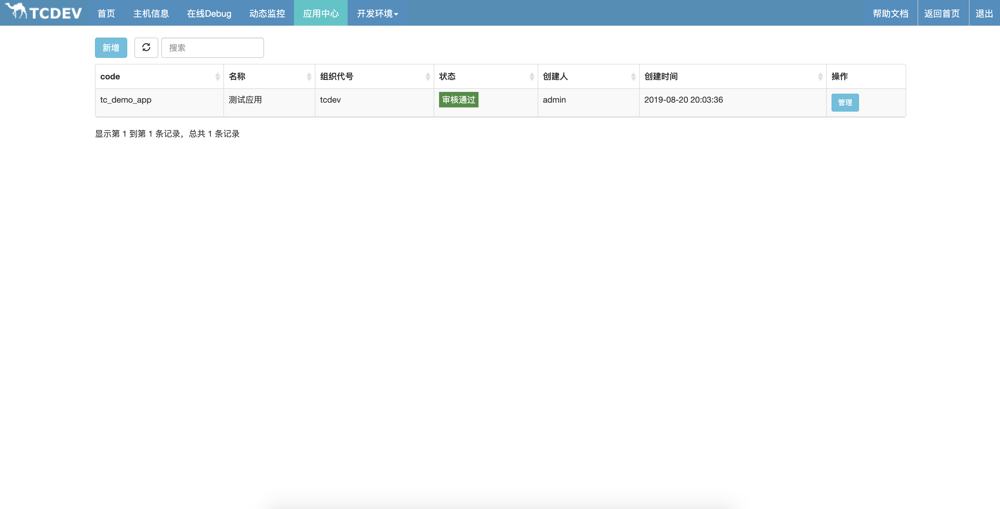
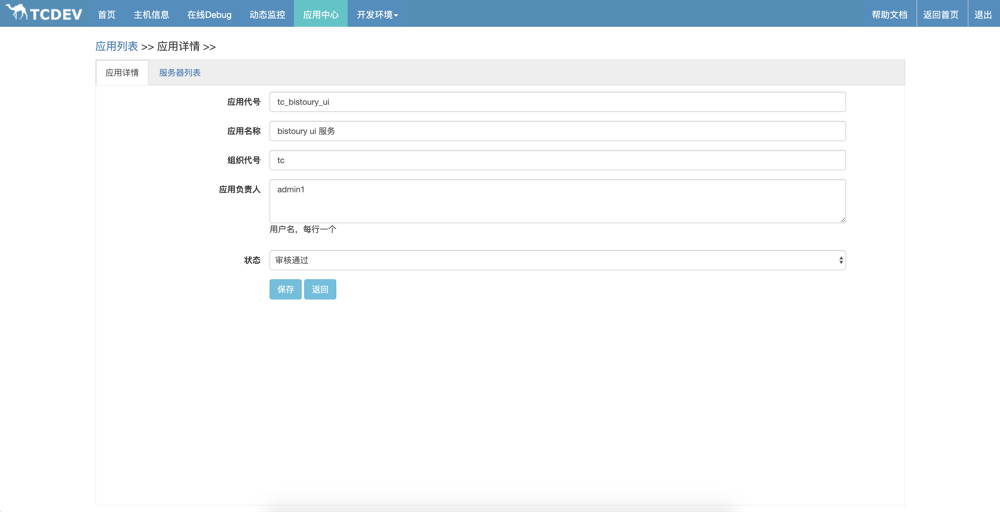
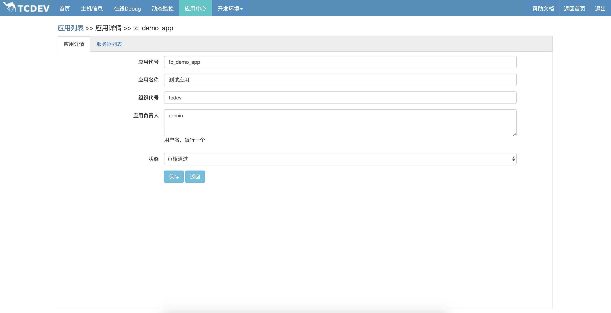
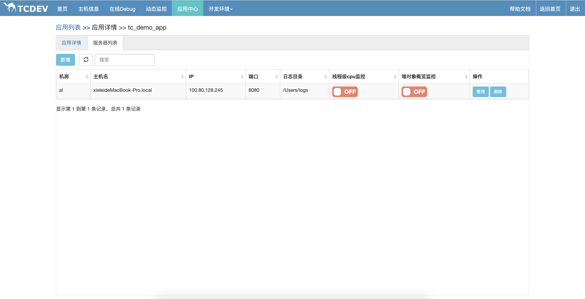

# 应用中心

在前面说过，Bistoury不仅仅可以从机器的维度，还可以从应用的维度对系统进行诊断。

## 应用是什么

我们知道，在线系统往往部署在多台机器上，应用就是与系统相关的这些机器以及所使用到的资源的一个集合。

应用中心就是用来管理应用信息的一个东西，而Bistoury需要从应用中心获取应用与机器、应用与人等各种信息。

Bistoury在ui内部集成了一个简单的应用中心，如果公司内部有自己的应用中心，应该实现`bistoury-application-api`模块中的接口接入自己的应用中心。

## 功能说明

应用中心主要职责如下：
- 人/应用/服务器之间的关系
- 应用/服务器的信息

## 使用说明
- 点击【应用中心】进入应用中心页面，这里会展示当前登录用户的所有应用

- 点击【新增】可以新增一个应用，新增应用时会默认将当前登录用户添加到应用负责人中.

- 点击【管理】可以对应用信息进行管理，可以修改应用信息

- 点击【服务器管理】tab也可以对当前应用的服务器信息进行管理，点击列表中的开关可以对线程级cpu监控等功能进行管理

- 点击新增按钮可以新增服务器，管理按钮可以对服务器信息进行管理。其中端口号用于agent与应用进行连接，日志目录用于查看日志
