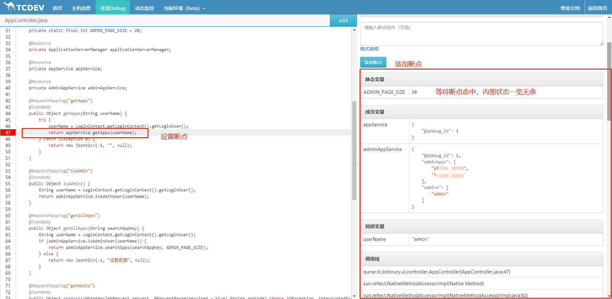
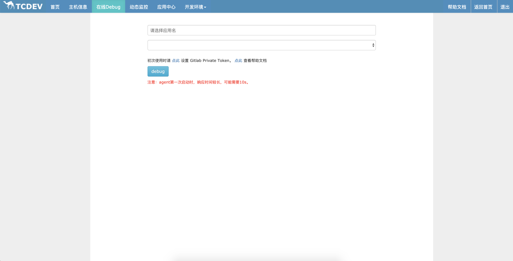
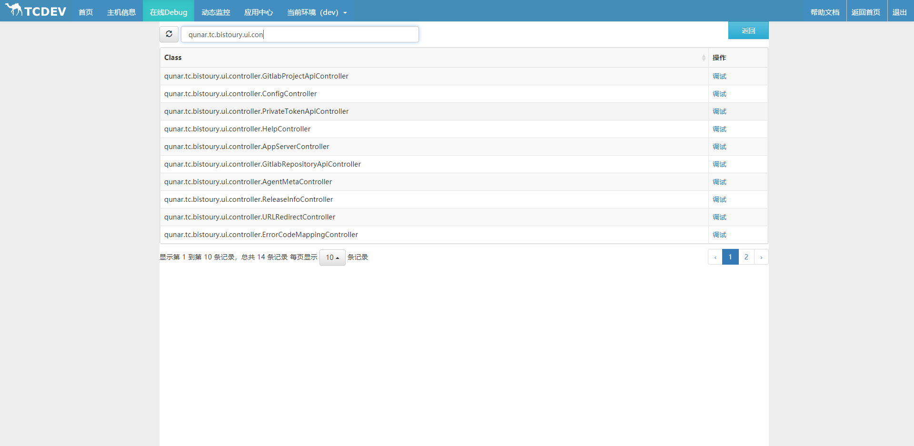
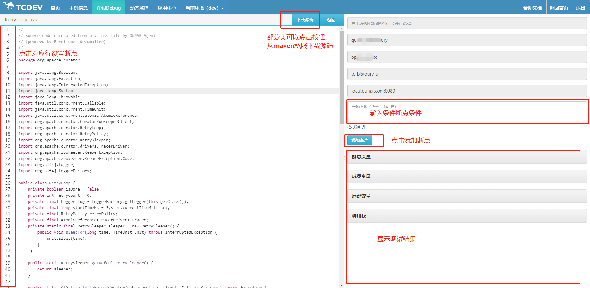

# 在线debug使用说明

曾经在微博上流传着这么一个程序员才懂的笑话：
> NASA要发射一个新型火箭，火箭发射升空后发现不行，NASA把火箭拖回来加了两行log，再次发射，发现又不行，又加了两行log发射，发现又不行....

当然这只是一个笑话，但这样的场景在我们的实际开发中却屡见不鲜，多少次系统重启后问题复现失败，多少次我们解决故障的时间就在不断地加log，发布，加log，发布的过程中溜走...

Arthas的watch命令让我们可以观察函数的入参、返回值、异常等等，然而似乎每次watch都需要看看文档里参数该如何设置，面对函数中的本地变量也是无能为力，特别是行数较多的方法，方法内部的情况还是难以明了。

不过这样的日子已经一去不复返了，Bistoury实现了在线Debug功能，它模拟了ide的调试体验，可以直接在代码上添加断点，甚至还支持条件断点。

断点触发后，Bistoury会捕捉断点处的各种信息，内部状态一览无余。

等等，这似乎就是ide的远程调试功能？

可以说很类似但又不一样：

- 在线debug在使用，功能上和远程调试，或者说你在ide上debug本地代码几乎一致。你在代码某一行打一个断点，断点触发就能看到本地变量、成员变量、静态变量以及调用栈

- 远程调试需要系统启动时就带上调试相关参数，线上应用启动时不可能默认打开调试功能，不说去加上参数然后重启系统的麻烦，重启后你想找的问题可能已经没法复现了；而在线debug不需要应用做任何操作

- 远程调试的断点触发后整个系统会暂停，线上应用这么操作很可能会导致故障；在线debug触发断点后只打印快照信息，打印完后继续执行代码逻辑，不影响系统的运行

看了这么多，不如来上手试一试，用过后你会发现，它就是在调试时你真正想要的那一个！


  
## 使用步骤

- 进入在线debug页面，初次使用时请先点击下方链接设置git private token，若不设置，则添加断点时的代码将会通过反编译产生。目前仅支持gitlab，点击输入框下方对应链接获取，然后点击保存设置private token


- 选择需要调试的应用名，再选择需要调试的机器，然后点击【debug】按钮，进入已加载类列表。

- 找到需要调试的类（支持搜索），点击【调试】按钮进入调试页面。类列表是在attach时获取的应用已加载的类。

    如果在attach之后有新的类加载（有时在列表中找不到自己想要的类，可能就是你要的类是在attach之后再加载的），可以通过点击【重新加载】加载按钮对列表进行重新加载。刷新按钮只会重新请求列表，不会重新加载

    选择“只加载新加载的类”只会加载应用中新加载的类；

    选择“全部加载”会把整个列表重新加载一遍。


- 找到需要调试的那行代码，点击前方的行号标记设置断点。对于内部类，需要内部类代码被执行过（**保证类被加载**）才能添加断点



## Q & A

### 对线上系统影响大吗，不会搞出故障吧？

在线debug已经在去哪儿内部使用较长一段时间，已接受各种线上系统的考验。

在线debug的断点只会触发一次，对于没有触发的调用，不会有任何影响；触发的那一次调用，会多出打印当前快照（本地变量、成员变量、静态变量以及调用栈）的损耗，快照打印完毕后继续执行代码逻辑

### 代码仓库在github上，每次debug都是反编译的代码，代码仓库能支持其它类型吗？

公司内部使用了gitlab，所以默认就是gitlab，目前刚刚开源，后续会对其它的做支持

## 条件断点使用说明

断点条件是使用Spring EL表达式来表示的

访问程序中的局部变量使用：localVariables[a]形式，其中a为局部变量的名称
访问程序中的类属性使用：fields[a]形式，其中a为类的属性名
访问程序中的静态变量使用：staticFields[CODE] 形式，其中CODE为静态变量名称
当有多个条件的时候，可以使用：&& || 来进行拼接。只需要使得最终的Spring EL表达式可以计算出一个boolean值就好。

更多的使用方式请参考官方文档：[http://docs.spring.io/spring-framework/docs/3.2.x/spring-framework-reference/html/expressions.html#expressions-language-ref](http://docs.spring.io/spring-framework/docs/3.2.x/spring-framework-reference/html/expressions.html#expressions-language-ref)

**注意：**

- 虽然程序支持Spring Expression，但是是针对 spring-expression 3.2.8.RELEASE调试出来的，如果你使用Spring express更新的版本的功能的话，那么可能程序不支持（解析出异常的情况程序默认为false）。
- 在进行条件判断时，使用“\=\=”，且“\=\=”两边不得存在空格，“&&”与“||”两边也不得存在空格
- <font color=red> 当访问变量里面的属性时，请先对变量进行非空判断</font>

**警告：**
为了防止用户调用自定义方法执行业务逻辑方法，条件断点中仅支持调用如下方法：

==白名单==: equals, length, valueOf, toString, hashCode, compareTo, size, count

### DEMO

```java
public class ForTest {
    private static final InnerBean BEAN = new InnerBean();
    private static final int CODE = 1000;
    private static final String A= "1";
    private static final short B= 1;
    private static final char C = 'c';
    private static final byte D = 1;
    private static final boolean E = false;
    private static final int F = 1;
    private static final long G = 1;
    private static final float H = 1;
    private static final short I = 1;
  
    private final String a = "1";
    private final short b = 1;
    private final char c = 'c';
    private final byte d = 1;
    private final boolean e = false;
    private final int f = 1;
    private final long g = 1;
    private final float h = 1;
    private final short i = 1;
    private final InnerBean bean = new InnerBean();
  
    private UserForTest user;
  
    public ForTest() {
    }
  
    public ForTest(UserForTest user) {
        this.user = user;
    }
  
    public void demo() {
        final String a = "1";
        final int b = 1;
        final double c = 1;
        System.out.println(a + b + c);
    }
  
    public void arguments(int aaaa, int bbbb) {
        System.out.println(aaaa + bbbb);
    }
  
    public void arguments(int a, int b, int c, int d, int f, int g, int h) {
        int a1 = a + b;
        int a2 = b + c;
        int a3 = c + d;
        int a4 = d + f;
        int a5 = f + g;
        int a6 = g + h;
        int a7 = g + h;
        System.out.println(a1 + a2);
    }
  
    public void arguments(int a, int b, int c, int d, int f, int g, int h, UserForTest user) {
        MyInterface myInterface = new MyInterface() {
            public void sayHello() {
                System.out.println("asa");
            }
        };
        int a1 = a + b;
        int a2 = b + c;
        int a3 = c + d;
        int a4 = d + f;
        int a5 = f + g;
        int a6 = g + h;
        int a7 = g + h;

        Map<String,String> map=new HashMap<>();
        map.put("key","value");
        List<String> list=new ArrayList<>();
        list.add("tcdev")

        System.out.println(a1 + a2);
    }
  
    public static interface MyInterface {
        void sayHello();
    }
  
    private static final class InnerBean {
        private final String a = "1";
        private final short b = 1;
        private final char c = 'c';
        private final byte d = 1;
        private final boolean e = false;
        private final int f = 1;
        private final long g = 1;
        private final float h = 1;
        private final short i = 1;
  
        public String getA() {
            return a;
        }
  
        public short getB() {
            return b;
        }
  
        public char getC() {
            return c;
        }
  
        public byte getD() {
            return d;
        }
  
        public boolean isE() {
            return e;
        }
  
        public int getF() {
            return f;
        }
  
        public long getG() {
            return g;
        }
  
        public float getH() {
            return h;
        }
  
        public short getI() {
            return i;
        }
    }
}
  
public class UserForTest {
    private String name;
    private Address address;
    public UserForTest() {
    }
  
    public UserForTest(String name) {
        this.name = name;
    }
  
    public String getName() {
        return name;
    }
  
    public void setName(String name) {
        this.name = name;
    }
  
    public Address getAddress() {
        return address;
    }
  
    public void setAddress(Address address) {
        this.address = address;
    }
  
    @Override
    public String toString() {
        final StringBuilder sb = new StringBuilder("UserForTest{");
        sb.append("name='").append(name).append('\'');
        sb.append('}');
        return sb.toString();
    }
}

public class Address {
    private String street;
  
    public Address() {
    }
  
    public Address(String street) {
        this.street = street;
    }
  
    public String getStreet() {
        return street;
    }
  
    public void setStreet(String street) {
        this.street = street;
    }
}
```

针对上面的测试类，如果我们的断点打在 public void arguments(int a, int b, int c, int d, int f, int g, int h, UserForTest user) 方法的最后一行的println语句上的话，那么下面的Spring EL表达式为true：

```java
String el ="localVariables[list][0].equals('tcdev') &&" +
        "localVariables[map]['key'].equals('value') && " +
        "localVariables[a] == 1 && " +
        "localVariables[b] == 2 && " +
        "localVariables[c] == 3 && " +
        "localVariables[d] == 4 && " +
        "localVariables[f] == 5 && " +
        "localVariables[g] == 6 && " +
        "localVariables[h] == 7 && " +
        "localVariables[a1] == 3 && " +
        "localVariables[a2] == 5 && " +
        "localVariables[a3] == 7 && " +
        "localVariables[a4] == 9 && " +
        "localVariables[a5] == 11 && " +
        "localVariables[a6] == 13 && " +
        "localVariables[a7] == 13 && " +
        "localVariables[user] != null && " +
        "localVariables[user].name.equals('rollen') && " +
        "localVariables[user].address != null && " +
        "localVariables[user].address.street != null && " +
        "localVariables[user].address.street.equals('beijing') && " +
        "fields[a].equals('1') && " +
        "fields[b] == 1 && " +
        "fields[c].toString().equals('c') && " +
        "fields[d] == 1 && " +
        "fields[e] == false && " +
        "fields[f] == 1 && " +
        "fields[g] == 1 && " +
        "fields[h] == 1 && " +
        "fields[i] == 1 && " +
        "fields[bean].a.equals('1') && " +
        "fields[bean].b == 1 && " +
        "fields[bean].c.toString().equals('c') && " +
        "fields[bean].d == 1 && " +
        "fields[bean].e == false && " +
        "fields[bean].f == 1 && " +
        "fields[bean].g == 1 && " +
        "fields[bean].h == 1 && " +
        "fields[bean].i == 1 && " +
        "staticFields[CODE] == 1000 && " +
        "staticFields[A].equals('1') && " +
        "staticFields[B] == 1 && " +
        "staticFields[C].toString().equals('c') && " +
        "staticFields[D] == 1 && " +
        "staticFields[E] == false && " +
        "staticFields[F] == 1 && " +
        "staticFields[G] == 1 && " +
        "staticFields[H] == 1 && " +
        "staticFields[I] == 1 ";

```
