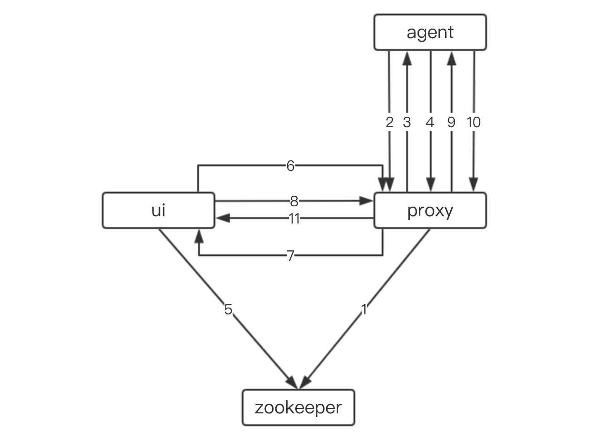

# 架构概览
下图是bistoury中各个组件及其交互图
- ui提供是用户操作的入口，用户的所有操作均在ui上完成。
- proxy是一个中间代理层，会将所有的用户操作转发到对应主机的agent上，并将agent的响应返回给ui。
- agent是部署在应用主机上，接受来自proxy转发的用户请求，并给出对应的响应。
- zookeeper用于服务发现，proxy将自己的信息注册到zk，ui在上面获取在线的proxy。

- 1、proxy启动并将自己的ip端口信息注册到zookeeper
- 2、agent启动并通过proxy的域名向proxy请求netty连接信息
- 3、收到请求的proxy返回自身的netty连接信息
- 4、agent根据获取到的netty连接信息连接proxy，并保持一个心跳
- 5、ui从zk上获取所有proxy的ip端口信息
- 6、请求proxy，确认我要连接的agent是否在当前proxy上
- 7、返回agent是否连接在本机的结果
- 8、ui使用websocket发送命令到proxy
- 9、proxy对命令进行初步加工校验后将命令转发到agent
- 10、agent返回命令的处理结果
- 11、proxy返回命令结果

