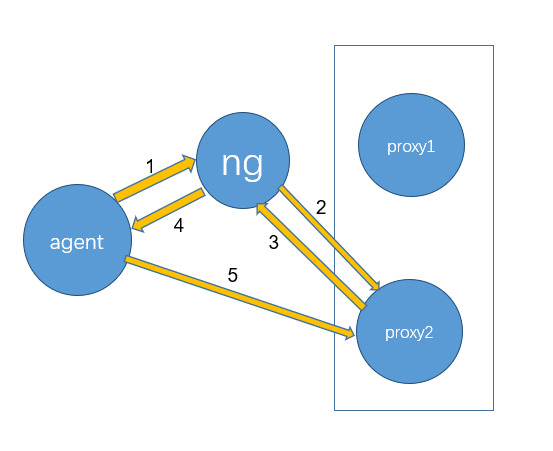
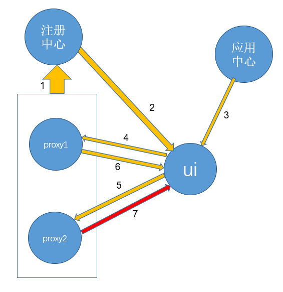
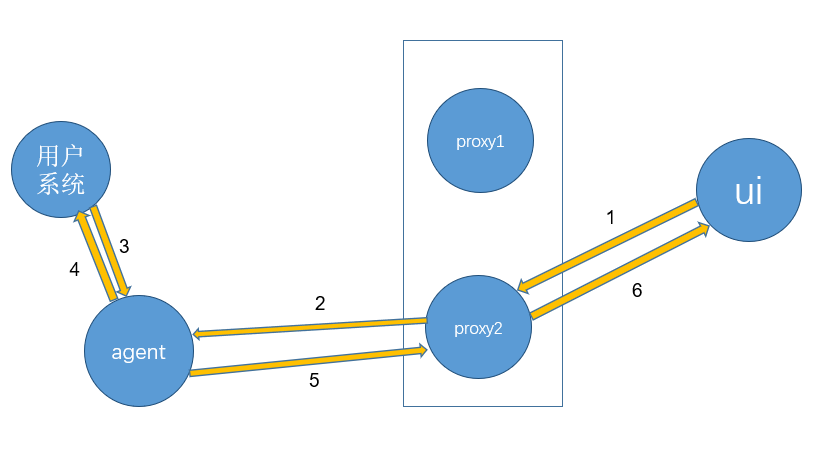

# 设计文档

这里是Bistoury的设计文档，还在逐步完善中...

关于部署方面的描述，这里主要是针对生产部署，快速部署是生产部署的简化。

## 组件

Bistoury涉及到的组件有用户系统，agent，proxy，ui，注册中心，负载均衡器，应用中心。

其中用户系统就是待诊断的正在运行的应用。

归属于Bistoury的必须要有的模块有三个：agent，proxy，ui.

一次命令执行的数据流向为 ui -> proxy -> agent -> proxy -> ui

## 一次命令的执行

### agent连接proxy

1. agent通过域名访问proxy
2. 访问请求打到proxy2这台机器上
3. proxy2返回自身ip和注册信息
4. agent接收到注册信息
5. agent注册到proxy2上，建立连接

### ui根据命令选择proxy

1. proxy集群机器全部注册到注册中心上
2. ui从注册中心获取到全部的proxy地址信息
3. ui从应用中心拿到要执行命令的机器信息
4. ui请求proxy1，判断要执行命令的机器是否与proxy1连接
5. ui请求proxy2，判断要执行命令的机器是否与proxy2连接
6. proxy1返回结果为否
7. proxy2返回连接存在

### 命令执行与结果返回

1. ui将命令信息发给proxy2
2. proxy2将命令发给agent
3. agent将命令发给用户系统（如果需要访问用户系统的话）
4. 用户系统将结果返回给agent（如果需要访问用户系统的话）
5. agent将结果返回给proxy2
6. proxy2将结果返回给ui

## 具体组件说明

### agent

agent和待诊断用户系统部署在同一台机器上，接收从proxy传来的命令，执行具体命令，返回结果给proxy。

这也意味着，agent应该在每一台有用户系统的机器上部署，它通过待诊断系统pid和待诊断系统进行连接，

目前只支持一个agent对应一个系统，对单机多用户系统的支持还不好，这个在后续的开发计划中。

### proxy

proxy是一个后端服务，它接收从ui传来的命令，并将命令给agent，最后接收从agent传来的结果并返回给ui。

proxy应该部署在多台独立机器上，作为proxy集群提供服务。

### ui

ui提供图形化和命令行界面，接收从用户传来的命令，传递命令给proxy，接收从proxy传来的结果并展示给用户。

ui作为和用户交互的组件也应该部署在多台独立机器上。

### 负载均衡器

agent需要在启动时就注册到一个proxy上，建立和proxy的连接，这就需要对proxy做一个负载均衡。
目前采用的是给proxy提供一个域名，agent在启动时通过域名访问，具体访问到的proxy会把自身的ip和一些信息返回给agent，agent再根据这个ip去建立一个netty连接。

为什么agent只注册到一个proxy而不是全部？一个proxy可以接受上万agent的连接，但机器越来越多，总有扛不住的时候。

为什么通过域名来提供负载均衡，而不是注册中心比如zk这种？agent数量非常大的情况下会对注册中心造成非常大的压力.

通过域名做负载均衡又有另外一个问题，假设现在有两台proxy，均衡分布了所有agent连接，
proxy1宕机一段时间，那么所有agent都会连接到proxy2上去（agent会在连接断掉的随机一段时间后重新初始化连接）。即使proxy1恢复，agent连接大部分还是连接在proxy2上，需要较长时间才能均衡，
因此建议proxy集群最好大于等于3台机器。

### 注册中心

负载均衡器这一小节说了agent只会注册到一个proxy上，那么我们要对某台机器执行命令时就需要选择相应的proxy。
目前采用的方式是proxy提供一个查询url，ui遍历请求所有proxy，选择出对应的proxy。

ui采用的是遍历方式，那就需要知道所有proxy的地址，而proxy的地址就注册在一个注册中心上。
注册中心目前只支持zookeeper，其它注册中心的支持正在开发中。

其实这里可以使用一个外部存储如redis，把proxy和具体机器的对应关系存储下来，ui直接从redis里面取对应proxy地址，有需要到同学也可以自己实现并提PR。

### 应用中心

应用中心是Bistoury用来获取用户的应用信息和机器信息的地方。

Bistoury内置了一个简单的应用中心，但想要获得完整而舒适的体验，还是需要用户接入自己的应用中心（通过实现bistoury-application模块的相关api接入）。

Bistoury所有命令入口的第一级都是应用，在选择了应用后，如果有第二级入口那就是具体机器。

为什么要这么设置，是因为我们的应用往往部署在不止一台机器上。

- 你可能记不住具体部署的机器名，但应用名应该是很清楚的，或者说很容易通过关键字搜索到，然后再在应用下选择具体机器，更加方便和直观

- 虽然部署在不同机器上，但是我们对外提供的服务是一个整体，从应用的维度考虑问题，可以获得更高的视角

- 可以在应用的层面做一些功能，比如我们已经提供了按应用grep日志等功能

在合理部署的情况下，用户系统应该在启动时自动注册到注册中心上，汇报自己的应用、机器信息（ip、域名等）、端口等信息。

除了要执行命令的应用和机器信息外，agent还需要获取待诊断系统pid来进行连接，这里提供两种方式做参考：

- 一种是用户系统启动时把pid参数也汇报上来。ui通过ip或域名等信息选择proxy，并将pid参数传给agent，agent通过传入的pid来连接应用。

- 一种是用户系统提供一个统一的url给agent获取用户pid等信息。ui通过ip或域名等信息选择proxy，并将用户系统端口号传给agent，
agent通过端口号访问本机url获取pid来连接应用。

