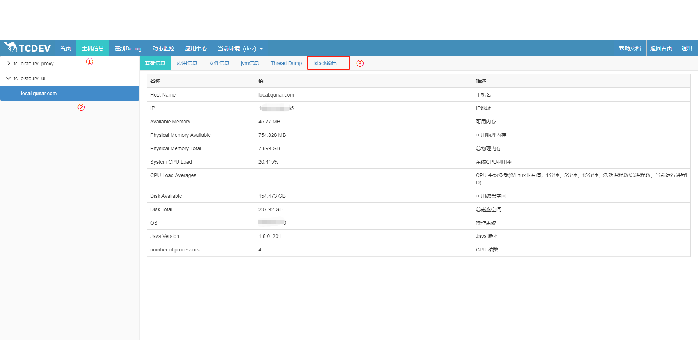
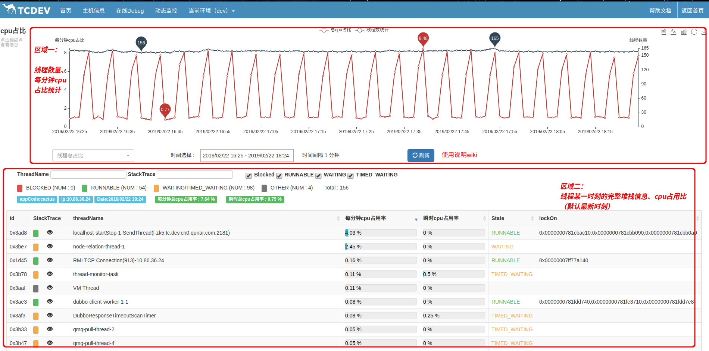
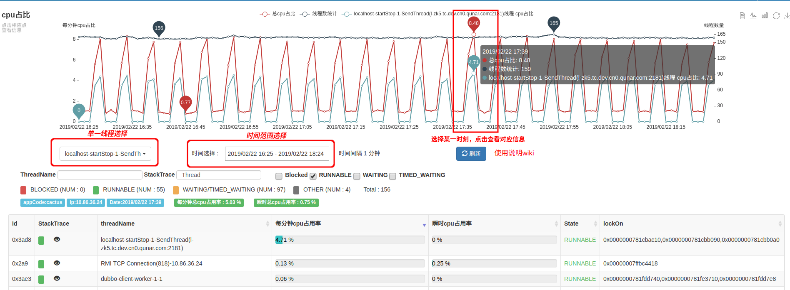
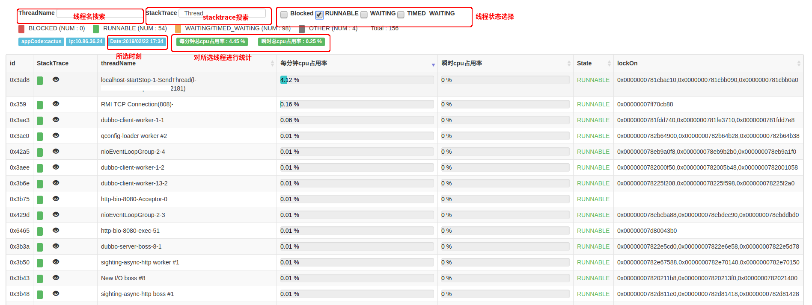
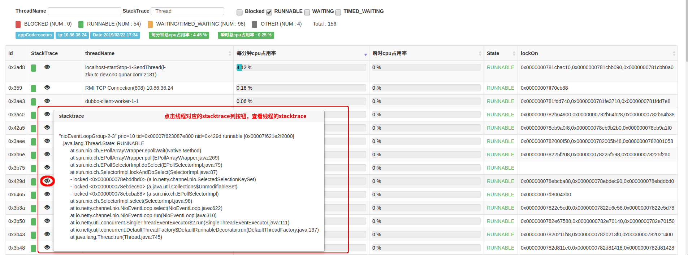

# 线程级cpu监控

在系统的日常运维中，我们有时会碰到cpu使用率突然飙高的情况。这个时候我们会登录机器，top查看进程id，top -h查看消耗cpu的线程id，然后jstack看看对应的线程是哪一个，最后再进行具体分析。
暂且不考虑这一系列操作需要的时间，我们收到报警的时候可能正在公司外吃饭，或是正在睡觉，而等我们做好准备登录上机器时问题已经结束了，现场没了，我们还能做的就只是看着机器的cpu监控图一脸茫然...

当遇到这些情况时，你会发现你需要的是线程级cpu使用率监控帮你指出问题线程，而不是传统的机器cpu使用率监控让你只能看着监控图一脸懵逼。

Bistoury就是你需要的那一个！我们提供了线程级的cpu使用率监控，它在本地保存了最近三天的线程级监控数据，还对每个线程每一分钟提供一个瞬时的线程调用栈。

## 系统

目前线程级cpu监控仅支持linux系统，mac系统尚不支持

## 使用
- 进入主机信息页面
- 选择需要查看的应用、机器
- 点击 【线程级cpu监控】

线程级cpu监控主要分为两个区域，区域一是线程数量和cpu占比的折线图，区域二是线程完整信息。

### 区域一

可以单独查看某一线程的cpu占比，也可以查看不同时间的cpu占比（支持最近三天），点击某一时间对应的点，可以在区域二展示具体的线程信息。

### 区域二

可以按照线程名、线程调用栈、线程状态对线程进行筛选，其中每分钟cpu占用率是该分钟内cpu使用占比，瞬时cpu使用占比，是指抓取数据时cpu瞬时cpu使用率占比。

stacktrace按钮展示

