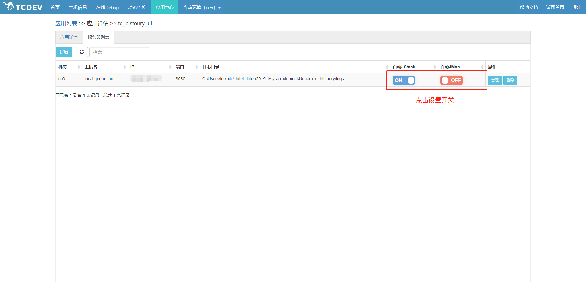

# jstack 及 jmap -histo使用说明

应用中心打开jstack开关后，agent每分钟会对应用进行一次jstack。只保存3天的jsack数据。(包含所有的线程调用栈\线程名字\状态)，同时也会对其cpu的占用率进行统计。
应用中心打开jmap开关后,jmap -histo 可以查看Java堆栈信息，本功能会每分钟获取jvm中的堆栈信息，提供查看近3天的历史堆栈信息，实时查看的是所有的堆栈信息，历史会按照占用内存的大小，保存占用较高的100个对象。

## 使用步骤

- 进入应用中心.
- 找到需要使用本功能的应用
- 点击服务器列表，
- 然后找到需要使用本功能的服务器，打开相应的开关。

  
## 功能入口

### jmap -histo

- 进入主机信息页面
- 选择需要查看的应用、服务器
- 点击【jvm信息】
- 点击【Heap Histo】

### jstack

- 进入主机信息页面
- 选择需要查看的应用、机器
- 点击 【jstack输出】

## jstack页面介绍

主要分为两个区域，区域一是线程数量和cpu占比的折线图，区域二是线程完整信息。

### 区域一

可以单独选择某一线程的cpu占比、时间范围的选择，点击某一时间对应的点，展示其具体的线程信息。

### 区域二

线程信息搜索条件

stacktrace按钮展示

