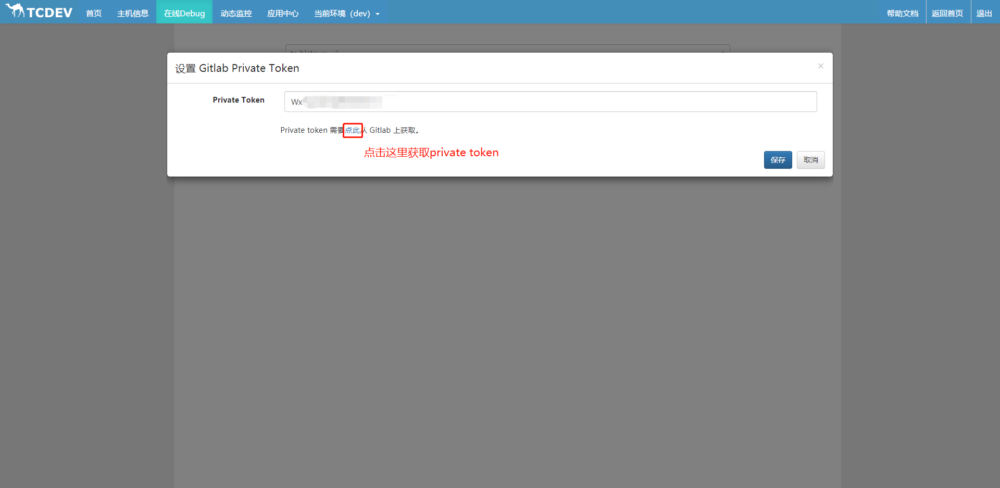
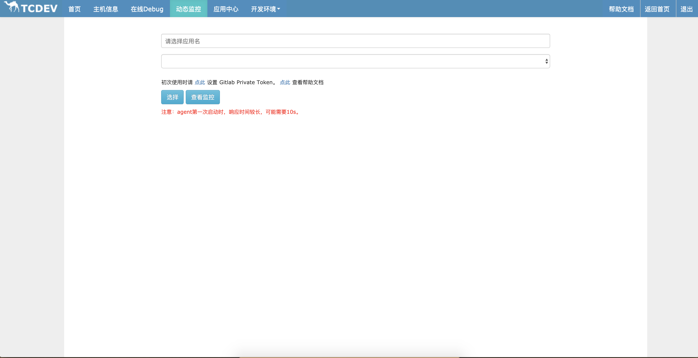
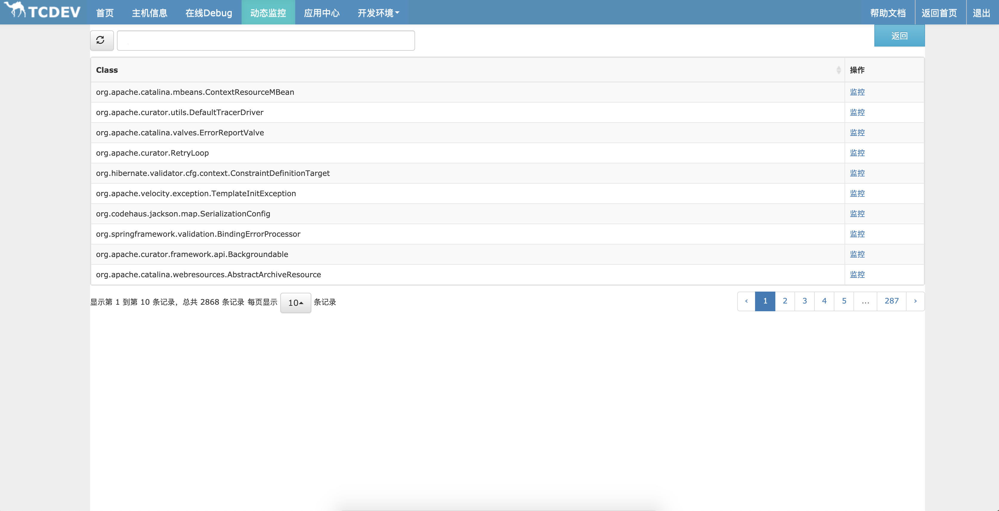
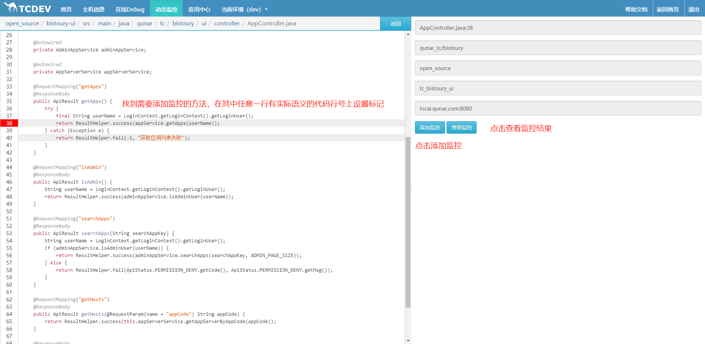
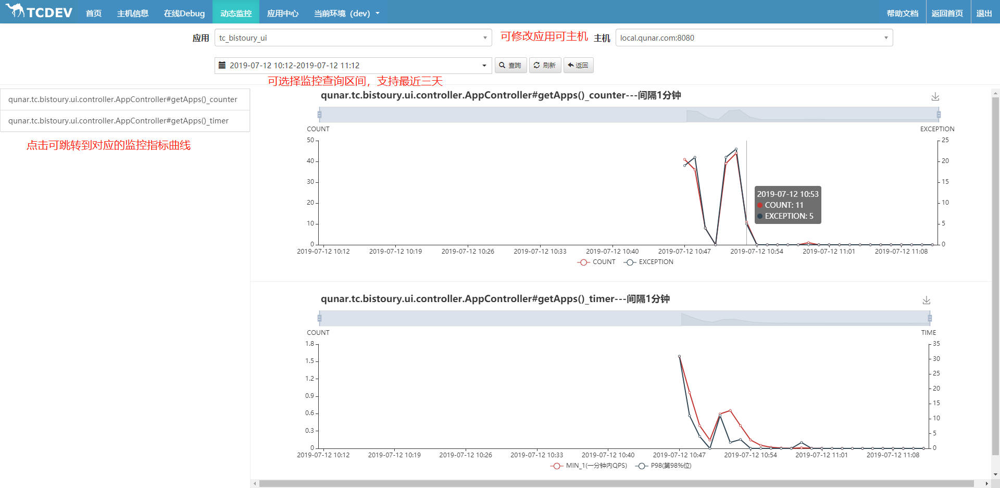

# 动态监控

有时候我们需要对系统的某个方法添加一个监控看看系统运行情况，但经历一次修改代码、qa检查、重新发布的流程又感觉不划算，这就是动态监控大显身手的时候了。
动态监控类似于Arthas的monitor方法，会对方法的执行时间、调用次数、失败次数进行监控，不同之处在于会生成对应的监控图，保留最近几天的数据，并且提供了web界面，通过类似添加断点的方式来添加监控。

**注意：** 监控会使用部分应用程序内存，建议内存较小的应用不要添加过多的动态监控。

## 监控生命周期

动态监控添加的指标生命周期与应用的的生命周期基本一致，从添加开始一直到应用停止，监控回一直采集监控数据。并存储最近三天的历史数据。

## 使用

- 进入动态监控页面，初次使用时请先点击下方链接设置git private token，若不设置，则添加断点时的代码将会通过反编译产生。目前仅支持gitlab，点击输入框下方对应链接获取，然后点击保存设置private token。

- 选择需要添加监控的应用名，再选择需要在哪台机器上添加监控，然后点击【选择】按钮，进入已加载类列表  

- 找到需要添加的类（支持搜索），点击【监控】按钮进入监控页面。类列表是在attach时获取的应用已加载的类。

    如果在attach之后有新的类加载（有时在列表中找不到自己想要的类，可能就是你要的类是在attach之后再加载的），可以通过点击【重新加载】加载按钮对列表进行重新加载。刷新按钮只会重新请求列表，不会重新加载。

    选择“只加载新加载的类”只会加载应用中新加载的类；

    选择“全部加载”会把整个列表重新加载一遍。

- 找到需要添加监控的方法，在其中任意语句添加标记，点击前方的行号标记所在行。对于内部类，需要内部类代码被执行过（**保证类被加载**）才能添加监控

- 在监控首页可以选择应用及机器后可以查看监控数据

