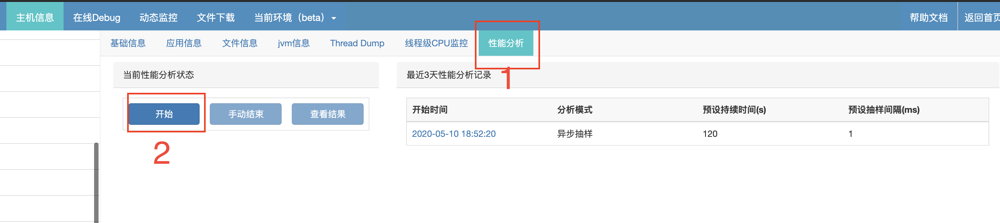
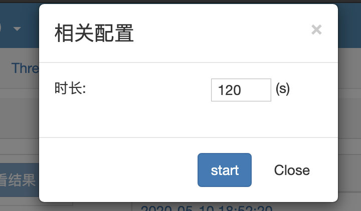
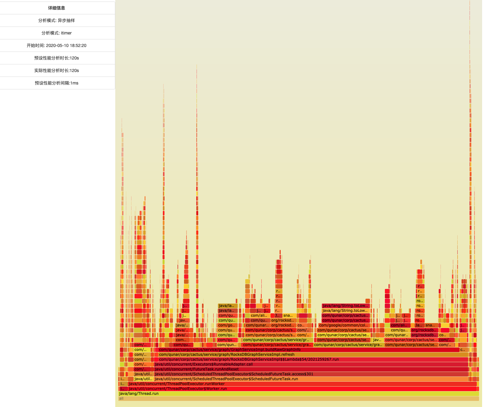
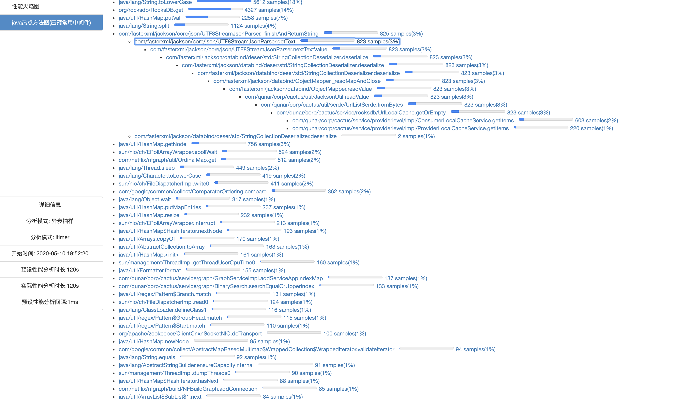

# 性能分析

## 前提
升级bistoury到最新版

## 保存时间
性能分析结果只保存三天

## bistoury中的性能分析

怎样去定位java程序的性能问题，常见的是抽样分析，但是类似于jstack对于程序的影响过大（而且有`Safepoint bias problem`）, 而且像新上的接口耗时上涨了20ms，这种如果使用线程dump之类的，可能无法定位具体问题所在

而bistoury基于异步抽样，是可以很好的定位java程序实际cpu耗时所在方法

基于[async-profiler](https://github.com/jvm-profiling-tools/async-profiler)

## 如何开始
`主机信息`里面点击`性能分析`,

选择抽样持续时间，就可以对应用程序进行性能分析(建议在应用运行一段时间后再进行，防止结果被jit影响)

查看结果:

### 火焰图

### java热点方法

## 系统支持
支持 Linux 和 macOS 平台
